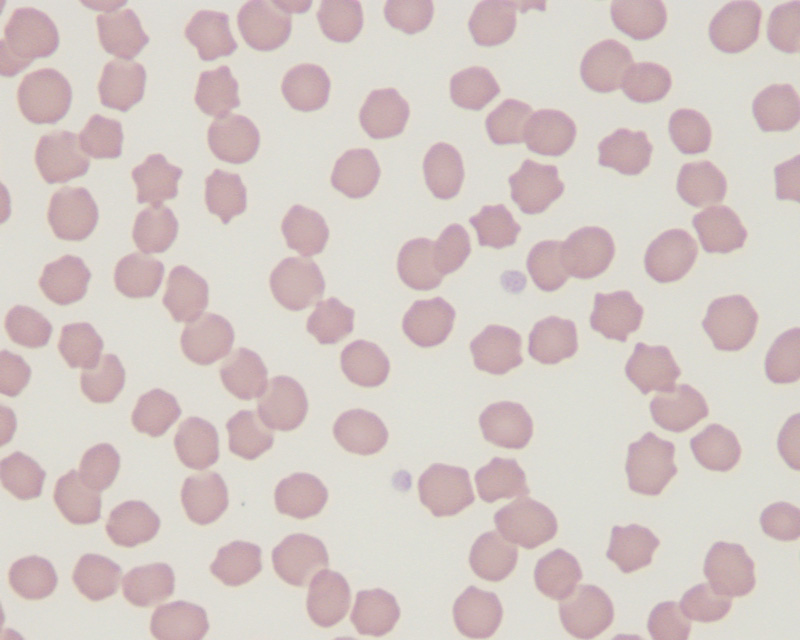
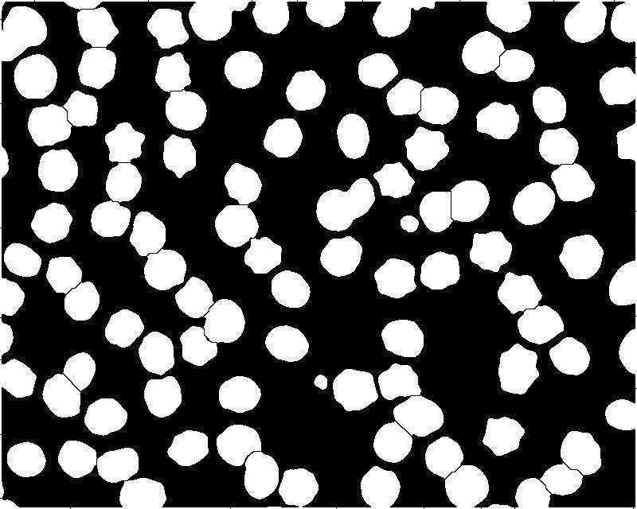

# manual-blood-image-classification
School assignment for separating abnormal red blood cell, normal red blood cell, and thrombocytes

1) Convert the Raw Image to Black and White
2) Analyze the data from the table (Color, Area, Perimeter, Roundness)
3) Based data from the table then manually set "if" condition to get the right cells
4) See the result (Abnormal, Normal, Thrombocytes)

## Images
<h3 align="center"> Raw Image </h3>

  

<h3 align="center"> Black and White Image </h3>

  

<h3 align="center"> Abnormal Red Blood Cells </h3>

  

<h3 align="center"> Normal Red Blood Cells </h3>

  

<h3 align="center"> Thrombocytes </h3>

  

